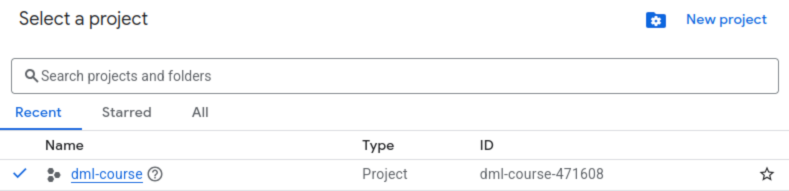

# Instructions for setting up Google Cloud

You will always be interacting with your instance in Google's servers via a terminal, or terminal emulator. Hence, it's important to know [a few commands](http://www.informit.com/blogs/blog.aspx?uk=The-10-Most-Important-Linux-Commands) to be able to perform simple tasks (like changing directories, copying files, moving files, etc).

# General advice to save cloud credits
 - Only have the virtual machine running when its actually running code.
 - A good workflow is to write code and run tests on your local machines. Once you confirm that everything works, only then you start the VM and run the full training.
 - The correct choice of batch size can increase training speeds significantly.
 - If your credits run out, you can exchange late days for new credits but this is discouraged. The initial credits your receive should last the entire course.

# General advice to mitigate the scarcity of GPU resources
There is a global shortage of cloud GPU resources. This can be frustrating, but is a real-world fact that is not unique to this course. Knowing how to deal with that, and having some experience from real-world cloud platforms a good preparation for work in this field.

Cloud VMs are defined in one of several geographical regions/zones. A zone near you will have lower latency, but may not have enough availability. Assume that you manage to start a GPU-equipped VM in one zone and then stop it to save credits. The next time you want to restart the same VM, all GPUs in that zone could be exhausted. If this happens, you need to try another time or create a new VM in another zone. If you create a VM in a new zone, it is not entirely straight-forward to get access to the data stored on the disk connected to the first VM.

To mitigate these difficulties, please consider the following:
- If you have access to your own GPU, consider using it to save yourself from cloud trouble.
- Do as much work as possible on the CPU before switching to GPU.
- When you're ready to train your model on a GPU, consider using our script option (3B) below to find an available GPU.
- Plan to do as much work as possible in one go once you successfullly started a VM, to minimize the hazzle if the VM can't be restarted at a later time.
- Do backups of your code and data repeatedly such that it's easier to set everything up on a new VM. Some options: 
  - Use git for source code (see [04_keep_git_repo_in_sync.md](04_keep_git_repo_in_sync.md))
  - Use the upload/download feature in jupyter notebook (see [03_using_jupyter_notebooks_on_cloud.md](03_using_jupyter_notebooks_on_cloud.md)) or in the ssh-in-browser window for data such as saved weights and images. If you want to download/upload multiple files, consider packing/unpacking with `tar -cvzf` and `tar -xvzf`.
  - Use google cloud storage buckets and the `gsutil` command-line tool (not documented in detail here, but easy enough to google)

## 1. Registration to, and preparations for using Google Cloud

- Open the registration link provided in the canvas announcement and fill in your full name as well as institutional email address.
- If you do not have a @net.chalmers.se @student.chalmers.se, @chalmers.se, or @student.gu.se email address, reach out to Lars, who should be able to help you out manually.
- After submitting your credentials, you will receive an email with a coupon code. Follow the URL in order to redeem the coupon.
- At this point, you will need a Gmail / Google account which you will use to log in to Google Cloud, and to which the coupons will be attached.

### Create a project

- Log in to http://console.cloud.google.com
- On Google Cloud, there is a concept called "projects". The purpose of a project is to organize your resources. In the Google Cloud portal, the currently selected project can always be seen in, and changed via, the dropdown menu at the top left of the console (e.g. "my-project" in below screenshot).<br />
  
- Expand the dropdown menu, and then create a new project, in which you will put your virtual machines later on.
- In the section on billing information, make sure to choose “Billing Account for Education”

### Increase GPU quota(s)

- For each project (you only need one) within which you want to use GPU-enabled virtual machines, you must first make sure that GPU resources are enabled, i.e. having enough quota to use them.
- Before continuing to increase the quotas, first make sure that the Google Cloud "compute engine" is activated - otherwise the quotas to be increased will not be visible.
  - Access the console menu by clicking on the hamburger menu icon (three horizontal bars) at the very top left of the web page.
  - Navigate to `Compute Engine` -> `VM Instances` page. If you don't see `Compute Engine` in the console, go to `View all products` at the bottom of the menu and find it there. You can also pin it to the console menu.
  - Now, the compute engine will most likely be automatically activated.
  - If unsure, you can also try to create an instance of any kind, and delete it, but we don't expect this to be necessary.
- At the `Compute Engine` -> `VM Instances` page, if there is a button named `Enable`, click on it, and follow the instructions to link your project with a billing account. This makes sure that you will use the free credits redeemed earlier. If you did not find any button `Enable` or no instructions to link to the billing account, it probably means that everything is good already.
- We are now ready to adjust the quota(s).
  - Access the hamburger menu (very top left) and navigate to `IAM & Admin` -> `Quotas & System Limits`. Again, find it under `View all products` if it's not in the menu.
  - Select the `filter` field, type `gpus_all_regions` and select that quota (display name `GPUs (all regions)`). It controls how many GPU-enabled instances you can have in parallel, and so definitely needs to be 1 or larger. We suggest 1 to start with, as this should be enough, and the chances for approval might be lower for higher numbers. If desired, later on you can try to increase this further.
  - To increase the quota, select it with the checkbox to the left and click `EDIT` at the top. Change the limit to 1. In the request description, write e.g. "For the use of GPU resources during a deep machine learning course at Chalmers University." Click `Next`, fill in your contact details and complete the request.
  - Once submitted, wait until you receive an email from Google (to your google account), confirming that the quota is indeed increased. **Note**: This could potentially take **two business days**, but is usually done within a couple of minutes.
  - Also make sure that you have quota for the specifics GPUs you might want to use. This should be ok by default, but good to verify. We recommend the L4 GPUs as a default choice. Type e.g. `L4` in the filter field to find relevant quotas. They are usually 1 or `unlimited` by default, which is good. Note that the "Preemptible" and "Committed" GPU quotas will not be necessary. Change the quotas here only if some relevant one is zero for some reason.
- At this point, you should be able to create GPU-enabled virtual machine instances!

## 2. Setup firewall rules
To run Jupyter notebook, you need to configure a firewall rule. This only has to be done once, despite creating additional instances in the future. If you plan to only run python scripts directly from an ssh shell, you can skip this step.
  - Access the console menu (top-left hamburger menu)
  - Go to `VPC network` > `Firewall`
  - Click `Create firewall rule`
  - **Name**: `allow-jupyter`
  - **Direction of traffic**: ingress
  - **Targets**: All instances in the network
  - **Source IP ranges**: `0.0.0.0/0`
  - **Specified protocols and ports**: Check `TCP`, and write `8888` in the corresponding textbox to the right side of it.
  - Click on `Create`

## 3A. Creating a virtual machine instance (manual)
- Log in to http://console.cloud.google.com
- Select the project in which you want to have the instance, and make sure that this project has enough quota for GPU resources (see previous step).
- Click on the hamburger menu icon (three horizontal bars) at the very top left of the console, and access the console menu.
- Navigate to `Compute Engine` -> `VM Instances`. The very first time you reach this page, you might have to wait a while for the compute engine to activate.
- To start creating your first instance, click on `Create instance`.
- Set a name for the instance.
- Select a region and a corresponding zone, e.g. "us-central1-a" or "europe-west1-b".
- In the VM configuration, Select `GPUs`.
  <br>

- Add a GPU to the machine:
  - The `L4` is the recommended choice. It's not the cheapest option, but not too expensive either, has reasonable availability and good driver support. We often had success creating this GPU in the `europe-west4` region, but availability varies.
  - The `T4` is another option. It's cheaper than the `L4` but has a bit less memory and it's often hard to get hold of one. However, using the provided script (option 3B below), it's not impossible.
  - We don't recommend the other GPUs. The `P4` was mentioned previous years, but we found the driver support to be lacking. Other GPUs are typically more expensive. You're welcome to try any GPU, but the teaching staff only supports the `L4` and `T4` options.
  - If you can't add a GPU, you need to change the region/zone to one where you can add GPUs. Availability of different GPUs varies between regions/zones, see this page: https://cloud.google.com/compute/docs/gpus/gpu-regions-zones
  - Hourly GPU prices can be seen here, for each region: https://cloud.google.com/compute/gpus-pricing#gpus.
- In the **"Machine type"** menu, we recommend going for the default options but adjusting to at least 15 GB RAM.
- Change the boot disk:
  - In the leftmost menu, click `OS and storage`
  - Under `Operating system and storage`, click `Change`.
  - Select the `Public images` tab.
  - For `Operating system`, select `Ubuntu Accelerator Optimized`. For `version`, select `Ubuntu 24.04 LTS NVIDIA version: 570`.
  - Increase the disk size to 50Gb.
  - Click `Select`
- In the monthly estimate overview this should be around 0.5 - 0.85 USD in hourly cost depending on otions.
- To complete, click `Create`. You will be redirected to the `VM instances` page, where a spinning icon indicates that the VM is being created. You may need to refresh the webpage to show updated status.
- GPU resources are scarce, so it is possible (even likely) that the instance does not start and show a red exclamation mark icon. Hover over it to see the error message. Click `Edit & Retry`, select a different region and click `Create` again. If this gets
tedious, check out the automatic option below.

## 3B. Creating a virtual machine instance (automatic)
Since it is tedious to attempt to create VMs in multiple regions, we developed a script that tries all regions where the GPU of interest is available automatically. The script is in the course repo, in the same directory as this instructions doc (https://github.com/dml-cth/deep-machine-learning/tree/master/instructions). To try it out, do as follows:
- Install the google cloud API python package. Activate your conda environment using `conda activate` as usual and type `pip install google-api-python-client`.
- Install the google cloud CLI tools according to instructions here: https://cloud.google.com/sdk/docs/install-sdk. The bundled python option should be selected. The installer will ask to run `gcloud init` for you. Select yes. This should open up a browser window. Authenticate with the google account you use for google cloud, check any boxes that appear and continue according to the instructions.
- To allow scripts to access your account, type `gcloud auth application-default login`. This will again open a browser window, where you again select the same google account and proceed as in last step. When you're done, you should see a message showing that you're authenticated.
- Find the ID of your project, which is different from the display name. Click the project picker (top-left part of the web page). You will see both your project name and ID. The ID typically consists of a name and some numbers.<br> 
- Open a command prompt with your conda environment activated. On windows, this could be a conda command prompt. Nagivate to the `instructions` directory of the course repo (where this file and `create_gcloud_vm.py` are located). Then type `python3 create_gcloud_vm.py` to show the help text.
- To actually start a VM, call the script with your project ID, the desired GPU type and your desired VM name as arguments. For example <br>```python3 create_gcloud_vm.py yourproject-12345 L4 lab-vm-1```<br>

**Note:** Once the instance is created (regardless of using method 3A or 3B), it will be automatically started, and **will begin to consume your credits**. You will see it listed like in below screenshot, where the green symbol indicates it is running.<br />
<br /> 
To stop the instance, select it, and click on the square stop symbol at the top of the page. If you get a warning message, just proceed.

**Note 2:** You can check how much you have used so far by going to the console menu, then `Billing` (-> `GO TO LINKED BILLING ACCOUNT` if you have multiple billing accounts) -> `Credits`.

**Note 3:** If you stop your VM, you usually don't have to create a new one, but can restart it again from the `Compute Engine` -> `VM Instances` page. If the GPU resources are now exhausted in your region, you need to try again at another time or create a new VM in another region instead.

Congratulations, you have now created your instance! Now keep following the next steps, in order to connect to it, and set up all the required software.


## 4. Connecting to the instance
- Select the project in which you have created your instance.
- Access the console menu (hamburger menu, top-left).
- Navigate to `Compute Engine` -> `VM Instances`, where you can see your instances (e.g. like below).
- Unless started already, select the instance you want to start, and click on the start button at the top of the page (the play symbol).
  - If the instance does not start due to an availability issue, try creating an instance in another region/zone instead. **Tip**: In order to access work stored on the previous instance, there is a possibility to first create a "machine image" from the previous instance and use it when creating the new instance. However, this is not supported by the automatic script, and we do not provide detailed instructions on this. As a general rule, we instead recommend to always make frequent backups of your work in any way that you are confident with.
- When the instance has started, click on the `SSH` symbol (as seen below), in order to connect to it.<br />
  
- Now, the Google Cloud Shell, which is basically a browser-based Linux terminal, will open up, and it will automatically connect to your instance through an SSH session.
  - It can take a little while for the instance to get ready after startup, such that you can connect to it. E.g. if you get the error message "Connection via Cloud Identity-Aware Proxy Failed", try to wait a little while and connect again.

- Congratulations, you have now connected to your instance! Any commands you run here will be performed by your instance, and the output will be displayed in this terminal.

- To verify that you have a GPU with working drivers, you can type `nvidia-smi` in the console. It should show an overview of the connected GPU resources (GPU type, RAM, usage, etc.).

- When you're done using your instance, you can execute the `exit` command, which will disconnect you from the instance. **Note that this does not stop the instance**. To do so, again go to the `Compute Engine` -> `VM Instances` page, select it, and click the stop button at the top of the page. Only at this point will it stop consuming credits.

## 4. Setting up all the required software in your instance

- Connect to your instance as described previously.

- In your instance, clone the course repository using the command:

  ```
  git clone https://github.com/dml-cth/deep-machine-learning.git
  ```

  This will create a folder in your home directory called `deep-machine-learning` (you can check the contents of your current directory with the command `ls`).

  - **Note**: This command must be run from your `home` directory (which is the one you start on after connecting to the instance).

- Now run the command:

  ```
  ./deep-machine-learning/instructions/configure_cloud_machine.sh
  ```

  When prompted whether to proceed, type press `a` or `y` according to the prompt. This will setup the same conda environment as used in the home assignments. It may take a few minutes, especially the part where conda is installing pip dependencies.

  - **Note**: If you just created your instance, you might run into the error `Unable to acquire dpkg frontend lock`. If that's the case, just wait a few minutes and try the same command again, the instance is still updating some packages in the background.

  - **Note** 2: Another possible error states that `dpkg was interrupted`. If you run into that, execute the command

    ```
    sudo dpkg --configure -a
    ```

    and re-run the previous command.
    This can also fail with an error message that proposes you to run:

    ```
    sudo apt --fix-broken install
    ```

    which should solve the problem. Again, you need to rerun the original `configure_cloud_machine.sh` script.

- Once everything is installed, execute the `exit` command and launch the SSH window from the instance overview page again.
  **Note**: This is important for the setup, so that the terminal is reinitialized; don't skip this step.

- You are now ready to start a Jupyter notebook in the instance and connect to it by following the instructions in [03_using_jupyter_notebooks_on_cloud.md](03_using_jupyter_notebooks_on_cloud.md).
